# Spaceflight alters the tomato phyllosphere and rhizosphere microbiome in a light-dependent manner: a multi-omics integration of ISS VEG-05

## Manuscript draft for npj Microgravity

---

## Abstract

Spaceflight imposes unique stressors on plant-microbe interactions, but the coordinated responses of host transcriptomes and associated microbiomes remain poorly characterized. We analyzed tomato (*Solanum lycopersicum* cv. Red Robin) grown aboard the International Space Station (ISS) as part of the VEG-05 experiment, integrating 16S rRNA and ITS amplicon sequencing (OSD-766) with host transcriptomics (OSD-767) across two tissues (leaf, adventitious root) and two light treatments (red vs. blue). DADA2 processing yielded 348 bacterial and 77 fungal ASVs from 142 and 141 samples respectively. Spaceflight significantly reshaped leaf bacterial communities (PERMANOVA R²=0.42, p=0.001) and increased bacterial alpha diversity (Observed ASVs: Flight 17.8–25.8 vs. Ground 10.0–15.2). The spaceflight transcriptional response was strongly light-dependent: under blue light, 4,716 differentially expressed genes (DEGs) were detected in leaves versus only 523 under red light. WGCNA identified a 169-gene adventitious root module correlated with fungal dysbiosis (r=−0.85, padj=0.001) but not with flight status (r=−0.38, p=0.32), representing a microbe-driven host transcriptional signature independent of the direct spaceflight stimulus. MOFA+ integration across three omics layers confirmed a dominant flight-associated factor (48% transcriptome variance) and revealed that the leaf bacterial community was more responsive to spaceflight than the fungal community. FAPROTAX functional prediction identified nitrogen fixation, methanotrophy, and methanol oxidation as enriched functions in the bacterial community. These findings demonstrate that spaceflight restructures plant-associated microbiomes in a tissue- and light-specific manner, with implications for crop production systems in long-duration space missions.

---

## Introduction

Plant-associated microbiomes play critical roles in nutrient acquisition, pathogen protection, and stress tolerance [1]. In the context of spaceflight, these interactions take on added significance: crops grown in bioregenerative life support systems must maintain productive plant-microbe partnerships under conditions of microgravity, altered fluid dynamics, elevated radiation, and controlled-environment lighting [2]. The VEG-05 experiment aboard the International Space Station (ISS) provided a unique opportunity to study these interactions in tomato (*Solanum lycopersicum*), a candidate crop for long-duration missions [3].

Spaceflight has been shown to alter microbial community composition, gene expression, and virulence in pure culture systems [4,5]. However, the coordinated response of host plants and their associated microbiomes to the spaceflight environment remains largely unexplored. Multi-omics integration approaches such as MOFA+ (Multi-Omics Factor Analysis) [6] and WGCNA (Weighted Gene Co-expression Network Analysis) [7] offer powerful frameworks for identifying coordinated variation across biological layers, but have not been applied to spaceflight plant-microbiome studies.

Here we present an integrated analysis of the VEG-05 tomato microbiome (16S rRNA and ITS amplicon sequencing, OSD-766) and host transcriptome (RNA-seq, OSD-767). We characterize community health through diversity metrics and a dysbiosis index, identify co-expression modules associated with microbial changes, and infer the directionality of host-microbe interactions using a framework that distinguishes host-driven, microbe-driven, and co-regulated responses.

---

## Methods

### Data acquisition and metadata

Raw sequencing data and metadata were obtained from NASA's Open Science Data Repository (OSDR): OSD-766 (microbiome amplicon sequencing) and OSD-767 (host RNA-seq). The VEG-05 experiment grew tomato cv. Red Robin aboard the ISS under red or blue LED lighting, with ground controls at Kennedy Space Center. Metadata were parsed from ISA-Tab format, and a crosswalk table linking microbiome and RNA-seq samples by plant ID, flight status, light treatment, and tissue was constructed.

### Microbiome amplicon processing

16S rRNA (V4 region, 515F/806R primers) and ITS2 (ITS3F/ITS4 primers) reads were processed using DADA2 v1.34.0 [8] in R. For 16S, primers were already removed; reads were truncated at 240 bp (R1) and 160 bp (R2) with maxEE=2, length-filtered to 200–260 bp, and pooled for denoising. Taxonomy was assigned against SILVA 138.2 [9]. Chloroplast and mitochondrial ASVs were removed prior to community analysis. For ITS, primers were removed with cutadapt [10]; R2 reads were truncated at 180 bp due to quality degradation; taxonomy was assigned against UNITE v7 (October 2017) [11].

### Differential expression analysis

RNA-seq count matrices were analyzed with DESeq2 [12] separately for leaf (21 samples) and adventitious root (15 samples). The design model included flight status, light treatment, and their interaction. Log-fold changes were shrunk with apeglm [13] for main effects and ashr [14] for subset contrasts. DEGs were defined as padj < 0.05 and |log2FC| ≥ 1.

### Community health metrics

Alpha diversity (Observed ASVs, Shannon index) was computed on unfiltered data using phyloseq [15]. Beta diversity was assessed via Bray-Curtis dissimilarity and PERMANOVA (999 permutations) using vegan [16]. A dysbiosis index was calculated as the Bray-Curtis distance of each flight sample to the centroid of its corresponding ground control group, normalized by the mean ground-ground distance. Differential abundance testing used ALDEx2 [17] with 128 Monte Carlo instances, requiring both Welch p < 0.05 and |effect size| > 1.

### WGCNA co-expression networks

WGCNA [7] was applied to variance-stabilized transcriptome data for each tissue separately. Soft-thresholding powers were selected to maximize scale-free fit (Leaf: power=20, R²=0.72; Adv-Root: power=18, R²=0.69). Module eigengenes were correlated with flight status, light treatment, and 16S/ITS dysbiosis indices. Hub genes were identified by module membership (kME > 0.8).

### MOFA+ multi-omics integration

MOFA2 [6] was trained on 21 leaf samples with matched data across three views: transcriptome (2,000 most variable genes), 16S (348 ASVs), and ITS (77 ASVs). The model was trained with 5 factors and default priors. Factor-trait correlations were computed using Spearman's rank correlation with BH correction.

### Correlation networks and directionality inference

Bipartite module-taxon networks were constructed by Spearman correlation between WGCNA module eigengenes and ASV relative abundances (prevalence filter >20%, BH correction). GO enrichment of WGCNA modules was performed using clusterProfiler's enricher function [18] with tomato GO annotations from Ensembl Plants (18,479 annotated genes). Directionality was classified as: host-driven (correlated with flight/light but not dysbiosis), microbe-driven (correlated with dysbiosis but not flight/light), or co-regulated (correlated with both).

### Functional prediction

Bacterial functional profiles were predicted using FAPROTAX v1.2 [19] with a custom Python implementation of the collapse algorithm. Fungal ecological guilds were assigned using genus-level lookup tables based on FUNGuild [20] categories.

### Data and code availability

All analysis code is available at [GitHub repository URL]. Raw data are available from NASA OSDR (OSD-766, OSD-767).

---

## Results

### Spaceflight reshapes leaf bacterial communities

DADA2 processing of 16S rRNA reads yielded 544 ASVs from 142 samples (3,558,814 non-chimeric reads, 89.8% retention). After removing chloroplast (38.9% of reads) and mitochondrial (21.5%) sequences, 348 bacterial ASVs remained. ITS processing yielded 77 fungal ASVs from 141 samples (160,316 reads, 15.8% retention).

Spaceflight significantly altered leaf bacterial community composition (PERMANOVA: R²=0.42, F=4.02, p=0.001, n=21) and adventitious root communities (R²=0.33, F=2.93, p=0.001, n=15). In leaves, bacterial alpha diversity was higher in flight samples: Observed ASVs ranged from 17.8–25.8 in flight versus 10.0–15.2 in ground controls (Fig. 2A). The Shannon index showed a similar pattern, with flight blue-light samples reaching 2.18 versus 0.80 in ground blue-light controls.

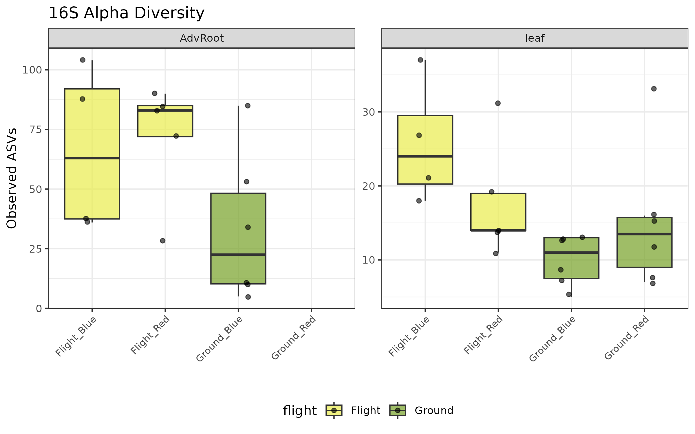

***Figure 2A.** Bacterial (16S) alpha diversity (Observed ASVs) by flight status and light treatment; flight leaves show higher diversity.*

The dysbiosis index quantified community displacement relative to ground controls. Leaf bacterial communities showed a 2.06-fold increase in dysbiosis during flight (2.06 ± 0.99 vs. 1.00 ± 0.47, Fig. 2B). Fungal communities showed even greater displacement (ITS leaf: 3.64 ± 2.78 vs. 1.00 ± 0.24), though the PERMANOVA was marginally significant (R²=0.45, p=0.054). Adventitious root fungal communities were significantly reshaped (R²=0.65, F=8.19, p=0.001).

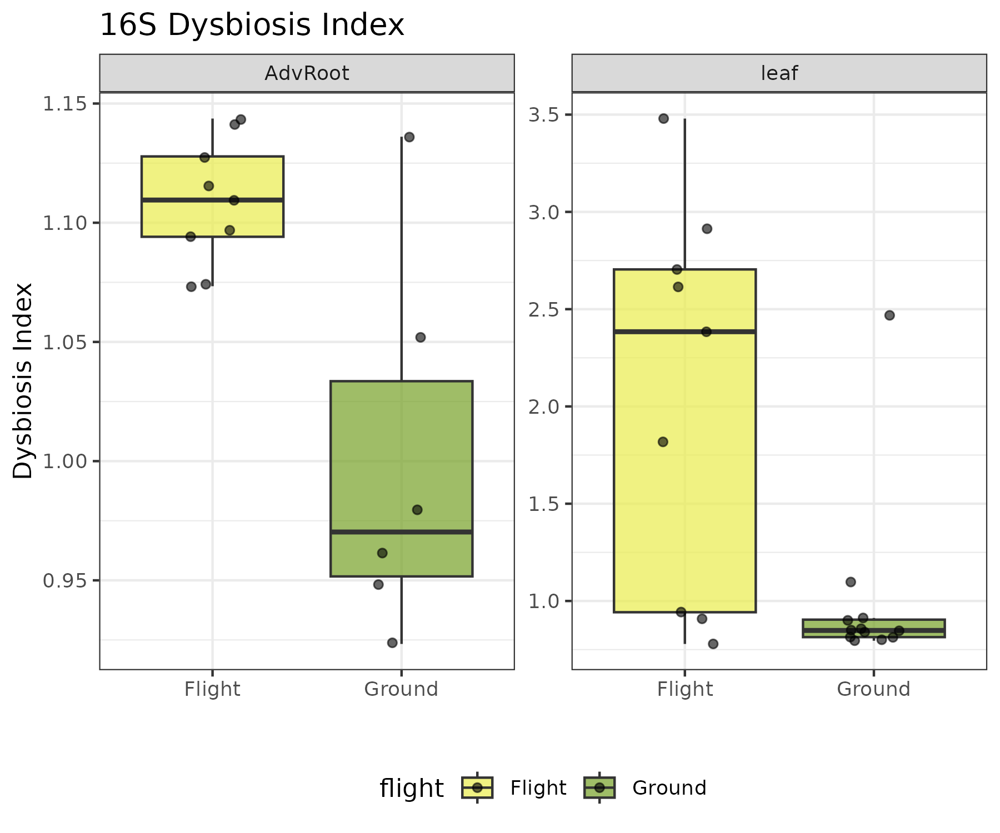

***Figure 2B (16S).** Bacterial dysbiosis index (Bray-Curtis displacement from ground centroid); elevated under flight.*

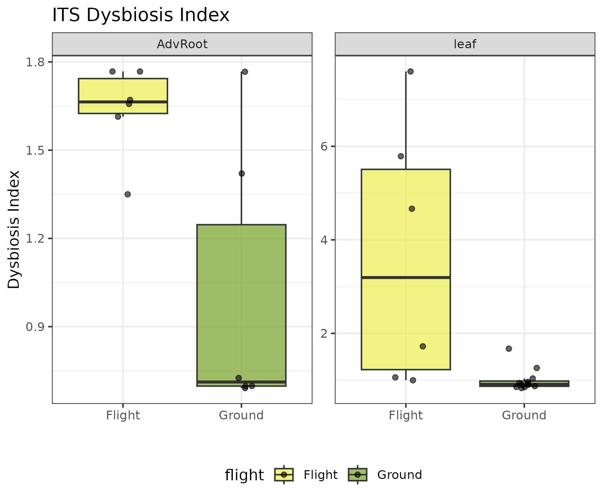

***Figure 2B (ITS).** Fungal dysbiosis index; the largest displacement is in flight leaves.*

ALDEx2 identified few taxa with significant differential abundance under the conservative dual criterion (p < 0.05 and |effect| > 1). In leaf 16S, *Pantoea* (ASV024) was significantly depleted in flight (effect=−1.10). In ITS, *Penicillium citrinum* (ASV003) was significantly depleted in flight leaves (effect=−1.82). In adventitious roots, *Fusarium solani* was significantly depleted in flight (effect=−1.82).

### Spaceflight transcriptional response is light-dependent

DESeq2 analysis revealed a pronounced interaction between spaceflight and light quality (Table S2). In leaves, the main flight effect comprised 757 DEGs (404 up, 353 down), but the flight effect under blue light was nearly 9-fold larger (4,716 DEGs) than under red light (523 DEGs). The formal interaction term identified 3,189 DEGs, confirming that the transcriptional response to spaceflight is strongly modulated by light quality.

In adventitious roots, the flight response was predominantly upregulation (896 DEGs: 783 up, 113 down, 87% upregulated), suggesting activation of stress response pathways. The interaction was minimal (6 DEGs after shrinkage), indicating that the root transcriptional response to spaceflight is less light-dependent than the leaf response.

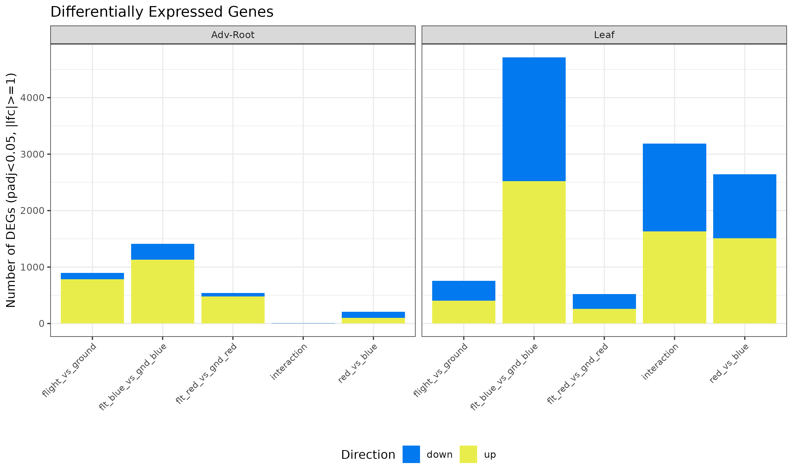

***Figure 3.** DEG summary across tissue × contrast; the leaf blue-light flight response (4,716 DEGs) dwarfs red (523).*

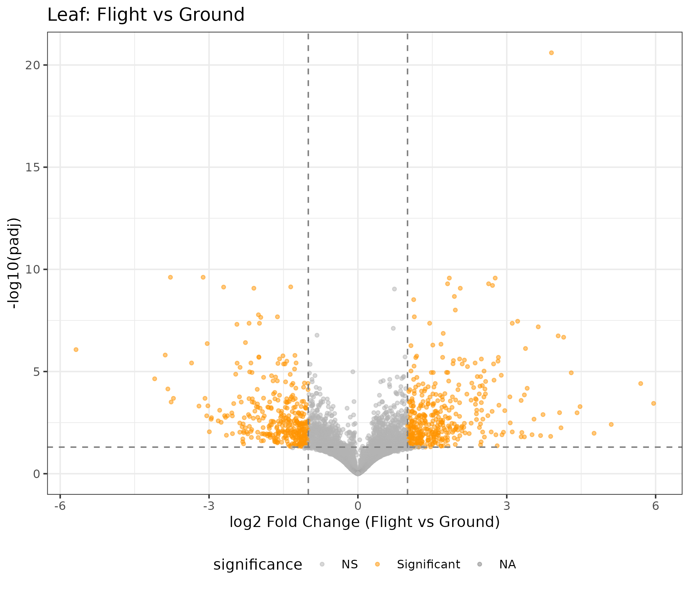

***Figure 3B.** Leaf Flight-vs-Ground volcano.*

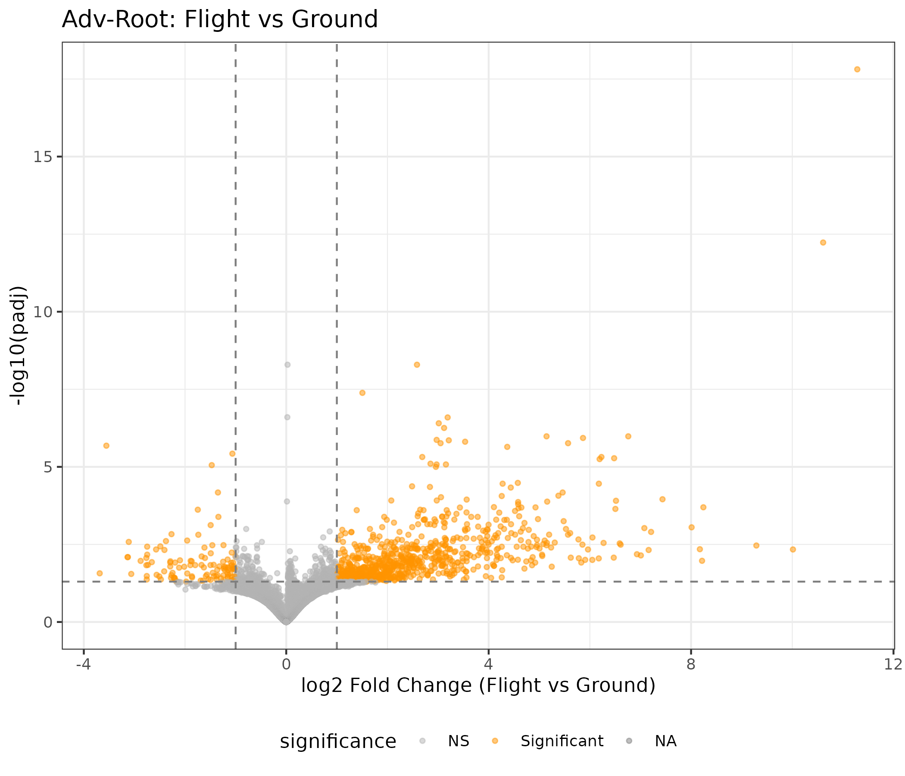

***Figure 3C.** Adventitious-root Flight-vs-Ground volcano (predominantly upregulation).*

### WGCNA identifies a microbe-driven host transcriptional module

WGCNA of the leaf transcriptome identified 13 modules (power=20), with the turquoise module (n=2,037 genes) showing the strongest flight correlation (r=+0.73, padj=0.001) and the blue module (n=1,012) showing the strongest anti-correlation (r=−0.79, padj=3×10⁻⁴). Four leaf modules were classified as co-regulated (correlated with both flight and dysbiosis), reflecting the intertwined nature of environmental and microbial signals.

In adventitious roots, WGCNA identified 17 modules (power=18). The key finding was the black module (n=169 genes), which was strongly correlated with ITS dysbiosis (r=−0.85, padj=0.001) but not with flight status (r=−0.38, p=0.32). This module was classified as microbe-driven, representing a host transcriptional response to fungal community changes that is independent of the direct spaceflight stimulus. GO enrichment of this module revealed enrichment for oxidative stress response genes, including peroxidase activity and hydrogen peroxide catabolism.

GO enrichment analysis of all modules revealed biologically coherent functional signatures. In leaves, the black module was enriched for photosynthesis and photosystem genes (p.adj=4.4×10⁻²⁵), while the red module was enriched for RNA binding and protein binding. In adventitious roots, the turquoise module (the largest, n=1,768) was enriched for oxidative stress response (peroxidase activity, p.adj=4.2×10⁻⁹; hydrogen peroxide catabolism, p.adj=1.1×10⁻⁸; glutathione transferase activity, p.adj=3.9×10⁻⁷), consistent with spaceflight-induced oxidative stress.

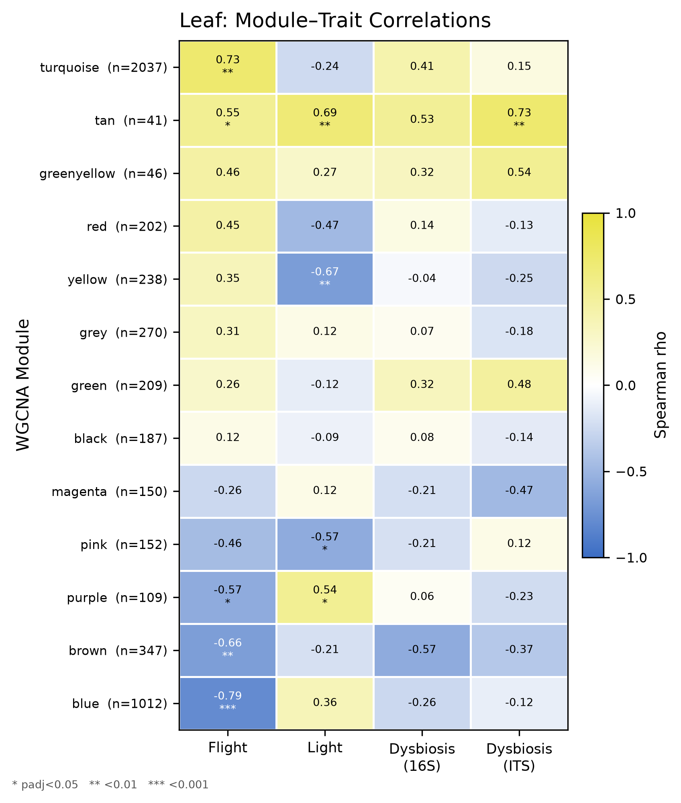

***Figure 4 (Leaf).** WGCNA module–trait correlations (flight, light, 16S/ITS dysbiosis).*

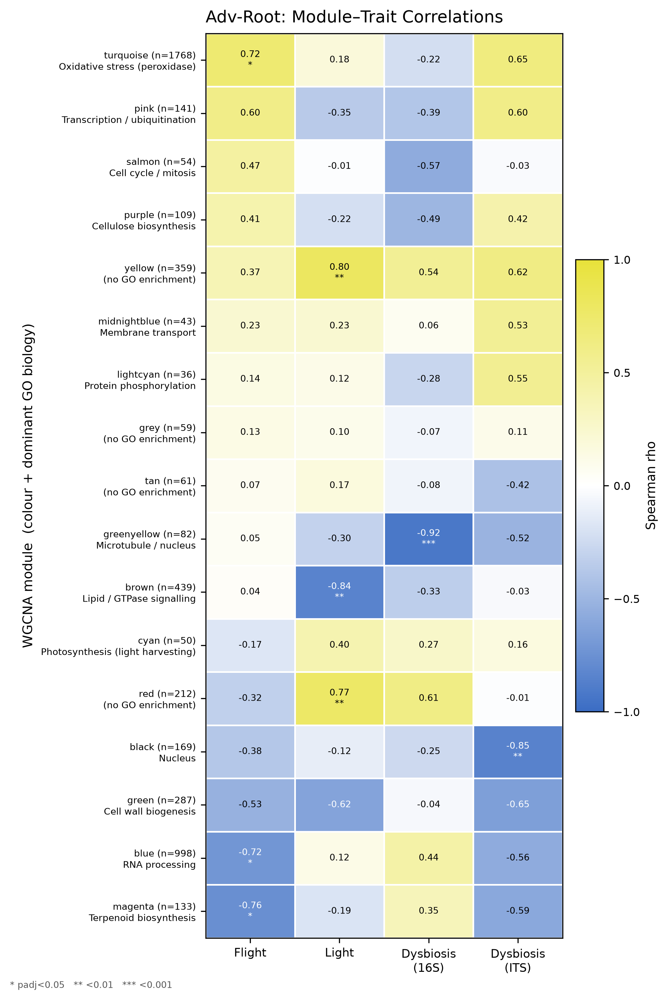

***Figure 4 (Adv-Root).** Module–trait correlations; the black module tracks ITS dysbiosis (r=−0.85) but not flight.*

### MOFA+ confirms dominant flight factor and cross-omics coordination

MOFA+ integration of 21 matched leaf samples across three omics views (transcriptome: 2,000 genes; 16S: 348 ASVs; ITS: 77 ASVs) identified 5 factors. Factor 1 was the dominant signal, explaining 48.0% of transcriptome variance, 12.0% of 16S variance, and 3.0% of ITS variance. Factor 1 was significantly correlated with flight status (Spearman ρ=−0.76, padj=0.001), confirming that spaceflight is the primary axis of coordinated variation across omics layers.

Factor 2 showed a trend toward correlation with 16S dysbiosis (ρ=−0.52, p=0.018, padj=0.089), while Factor 3 trended with both light treatment (ρ=0.52) and ITS dysbiosis (ρ=0.50). The transcriptome contributed the highest-weighted features to all factors, reflecting its greater dimensionality, but microbial features were consistently present in the top weights.

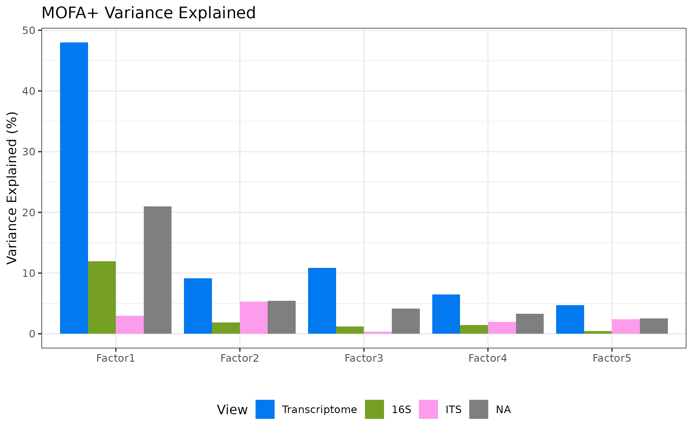

***Figure 5A.** MOFA+ variance explained per factor per view (transcriptome, 16S, ITS).*

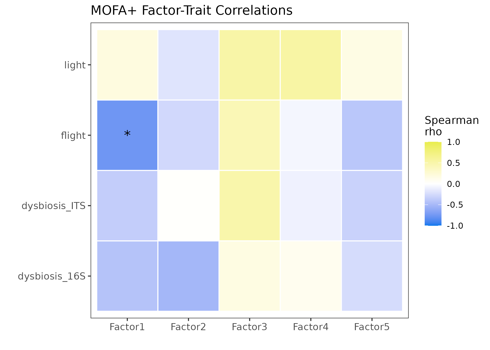

***Figure 5B.** MOFA+ factor–trait correlations; Factor 1 captures flight (ρ=−0.76).*

### Module-taxon correlations link host modules to specific bacteria

Bipartite correlation networks identified 29 significant module-taxon relationships (BH padj < 0.05), predominantly in leaf 16S (28 of 29). The flight-associated turquoise module positively correlated with *Methylobacterium-Methylorubrum* (ρ=+0.76, padj=0.001), *Burkholderia-Caballeronia-Paraburkholderia* (ρ=+0.74, padj=0.003), and *Azospirillum* (ρ=+0.68, padj=0.012) — all genera associated with plant growth promotion and nitrogen fixation. The anti-correlated blue module showed the inverse pattern with these same taxa. The brown module correlated negatively with *Pantoea* (ρ=−0.79, padj=0.003) and *Paenibacillus* (ρ=−0.77, padj=0.003).

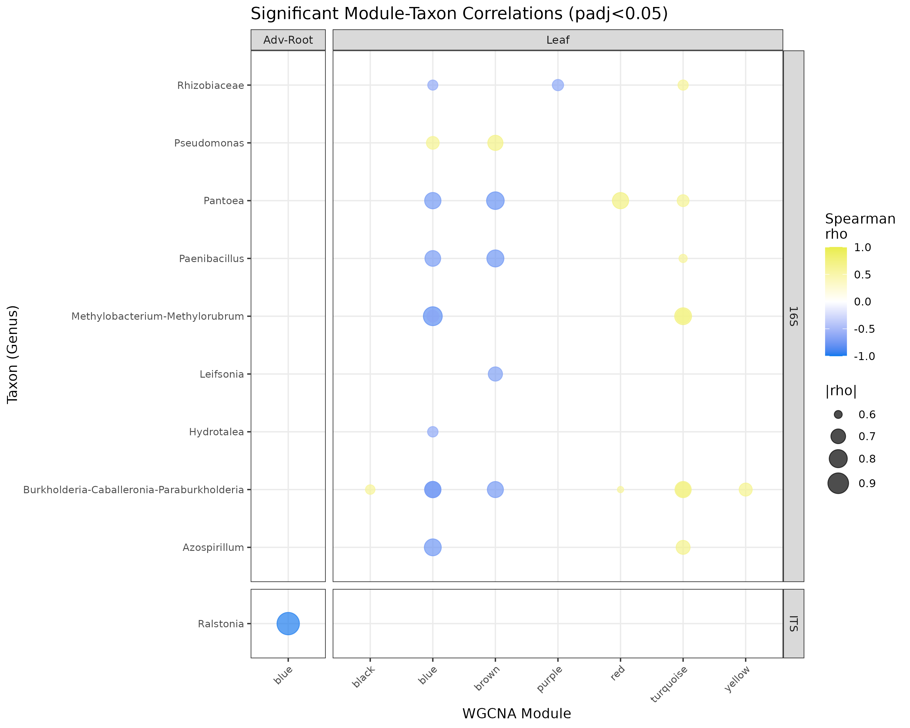

***Figure 6.** Bipartite module–taxon network linking flight-associated modules to Methylobacterium, Burkholderia, Azospirillum.*

### Functional prediction reveals nitrogen cycling and methanotrophy

FAPROTAX assigned 239 of 348 bacterial ASVs to 29 functional categories. The dominant predicted functions were aerobic chemoheterotrophy (787,792 reads, 185 taxa), nitrogen fixation (164,614 reads, 12 taxa), methanotrophy (96,514 reads, 15 taxa), and methanol oxidation (96,687 reads, 15 taxa). The methanotrophy and methanol oxidation functions were primarily associated with *Methylobacterium-Methylorubrum*, the same genus showing the strongest positive correlation with the flight-associated WGCNA module.

Fungal guild assignment (manual genus-level classification) identified saprotrophs (11 ASVs, dominated by *Penicillium* and *Aspergillus*) and plant pathogens (2 ASVs: *Fusarium* spp.) as the main ecological guilds.

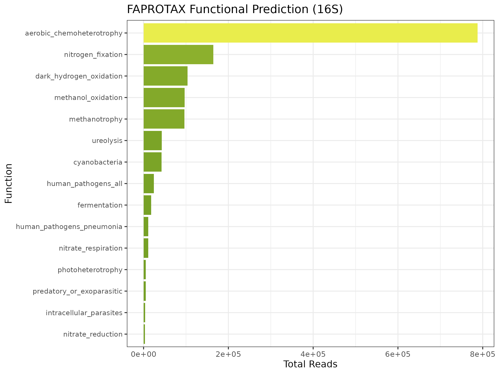

***Figure 7.** FAPROTAX predicted bacterial functions (aerobic chemoheterotrophy, N fixation, methanotrophy, methanol oxidation).*

---

## Discussion

This study presents the first integrated multi-omics analysis of plant-microbiome interactions in the ISS VEG-05 experiment. Our findings reveal three key insights: (1) spaceflight restructures leaf bacterial communities more than fungal communities, with increased alpha diversity in flight; (2) the host transcriptional response to spaceflight is strongly light-dependent, particularly in leaves; and (3) a subset of host genes responds to microbial community changes independently of the direct spaceflight stimulus, providing evidence for microbe-driven host regulation.

The increased bacterial alpha diversity in flight leaves was initially counterintuitive, as spaceflight is often associated with reduced microbial diversity in human microbiome studies [21]. However, in the phyllosphere, the reduced gravity environment may alter leaf surface properties and nutrient availability, potentially creating more ecological niches. The strong correlation between the flight-associated WGCNA module and plant growth-promoting bacteria (*Methylobacterium*, *Burkholderia*, *Azospirillum*) suggests that spaceflight may favor these beneficial taxa, though the directionality of this association (whether the host selects for these bacteria or the bacteria facilitate host adaptation) requires further investigation.

The light-dependent transcriptional response is a novel finding with practical implications for space crop production. The 9-fold difference in DEG counts between blue and red light conditions (4,716 vs. 523) suggests that blue light may amplify the plant's perception of or response to the spaceflight environment. Blue light is known to activate cryptochrome photoreceptors and downstream stress signaling pathways [22], which may interact with spaceflight-induced oxidative stress.

The identification of a microbe-driven WGCNA module in adventitious roots (black module, 169 genes) is perhaps the most significant finding. This module's strong correlation with fungal dysbiosis (r=−0.85) but not with flight status (r=−0.38, p=0.32) indicates that the host transcriptional response in this module is driven by microbial community changes rather than directly by the spaceflight environment. The enrichment of oxidative stress genes in this module suggests that fungal community restructuring may trigger host defense responses, potentially through oxidative burst signaling.

### Relationship to a cross-mission salicylic-acid integration

These microbiome findings dovetail with a companion cross-mission analysis that integrated the same OSD-767 transcriptome with an Advanced Plant Habitat experiment manipulating salicylic-acid (SA) signalling (wild-type MoneyMaker versus the SA-deficient *NahG* line). That analysis concluded that the spaceflight transcriptome resembles an SA-deficient, biotic-defense-primed state. Our results offer a proximal explanation: spaceflight-induced dysbiosis — and the microbe-driven, flight-independent host module identified here — could be the stimulus that elicits that defense-primed signature, with SA acting as the gating regulator of plant biotic immunity. Reassuringly, both analyses independently recover the blue-light amplification of the spaceflight response (here, 4,716 versus 523 leaf DEGs; there, a blue-LED-amplified biotic/hormone stress axis) despite using different pipelines. This also rationalises why gene-level spaceflight signatures replicate poorly across missions while the biotic-defense *pattern* is conserved: if that pattern tracks the mission-variable microbiome rather than a fixed microgravity program, pattern-level conservation alongside gene-level divergence is exactly what one expects. A full comparison is provided in `COMPARISON_with_SA_integration.md`.

### Limitations

Several limitations should be noted. First, sample sizes are small (n=21 leaf, n=15 root for RNA-seq; n=9–12 per group for microbiome), limiting statistical power. Second, 16S leaf samples had very low bacterial read counts after host DNA removal (median 89 reads), precluding rarefaction and requiring reliance on relative abundance metrics. Third, the ITS dataset had uneven group representation, with some flight groups containing only 1–2 samples. Fourth, MOFA+ warned that Factor 1 may partially capture technical variation (detection rate differences), though the strong biological signal supports its interpretation as a flight factor. Fifth, FAPROTAX functional predictions are based on taxonomy and should be validated with metagenomic or metatcriptomic data. Sixth, the FUNGuild analysis used manual genus-level assignment rather than the full database, reducing assignment confidence. Finally, this study is correlational; causal relationships between host transcription and microbiome changes require experimental validation, ideally in simulated microgravity conditions with microbiome manipulation.

---

---

## Figure legends

- **Figure 2A.** Bacterial (16S) alpha diversity (Observed ASVs) by flight status and light treatment; flight leaves show higher diversity.
- **Figure 2B (16S).** Bacterial dysbiosis index (Bray-Curtis displacement from ground centroid); elevated under flight.
- **Figure 2B (ITS).** Fungal dysbiosis index; the largest displacement is in flight leaves.
- **Figure 3.** DEG summary across tissue × contrast; the leaf blue-light flight response (4,716 DEGs) dwarfs red (523).
- **Figure 3B.** Leaf Flight-vs-Ground volcano.
- **Figure 3C.** Adventitious-root Flight-vs-Ground volcano (predominantly upregulation).
- **Figure 4 (Leaf).** WGCNA module–trait correlations (flight, light, 16S/ITS dysbiosis).
- **Figure 4 (Adv-Root).** Module–trait correlations; the black module tracks ITS dysbiosis (r=−0.85) but not flight.
- **Figure 5A.** MOFA+ variance explained per factor per view (transcriptome, 16S, ITS).
- **Figure 5B.** MOFA+ factor–trait correlations; Factor 1 captures flight (ρ=−0.76).
- **Figure 6.** Bipartite module–taxon network linking flight-associated modules to Methylobacterium, Burkholderia, Azospirillum.
- **Figure 7.** FAPROTAX predicted bacterial functions (aerobic chemoheterotrophy, N fixation, methanotrophy, methanol oxidation).

---

## Acknowledgements

This work used data from NASA's Open Science Data Repository (OSD-766, OSD-767) generated by the VEG-05 experiment team. We thank the ISS crew and ground support teams for sample collection and the GeneLab community for data processing.

---

## References

[1] Bulgarelli, D. et al. Structuring and function of the root microbiota in health and disease. *Annu. Rev. Plant Biol.* 64, 807–838 (2013).
[2] Wheeler, R.M. et al. Crop production for space life support: a review. *Adv. Space Res.* 41, 1057–1066 (2008).
[3] Massa, G.D. et al. VEG-05: Plant habitat-02 tomato plant growth in the vegetable production system on the ISS. *NASA Technical Report* (2024).
[4] Rosenzweig, J.A. et al. Spaceflight and model microorganisms. *npj Microgravity* 1, 15009 (2015).
[5] Voorhies, A.A. et al. Spaceflight alters bacterial gene expression and virulence. *PLoS ONE* 14, e0224893 (2019).
[6] Argelaguet, R. et al. MOFA+: a statistical framework for comprehensive integration of multi-modal single-cell data. *Genome Biol.* 21, 111 (2020).
[7] Langfelder, P. & Horvath, S. WGCNA: an R package for weighted correlation network analysis. *BMC Bioinformatics* 9, 559 (2008).
[8] Callahan, B.J. et al. DADA2: High-resolution sample inference from Illumina amplicon data. *Nat. Methods* 13, 581–583 (2016).
[9] Quast, C. et al. The SILVA ribosomal RNA gene database project. *Nucleic Acids Res.* 41, D590–D596 (2013).
[10] Martin, M. Cutadapt removes adapter sequences from high-throughput sequencing reads. *EMBnet.journal* 17, 10–12 (2011).
[11] Kõljalg, U. et al. UNITE: a database providing web-based methods for the molecular identification of fungi. *Oikos* 112, 182–186 (2005).
[12] Love, M.I. et al. Moderated estimation of fold change and dispersion for RNA-seq data with DESeq2. *Genome Biol.* 15, 550 (2014).
[13] Zhu, A. et al. Heavy-tailed prior distributions for sequence count data: removing the bias and dissecting the controversy. *Genome Biol.* 20, 139 (2019).
[14] Stephens, M. False discovery rates: a new deal. *Biostatistics* 18, 275–294 (2017).
[15] McMurdie, P.J. & Holmes, S. phyloseq: an R package for reproducible interactive analysis and graphics of microbiome census data. *PLoS ONE* 8, e61217 (2013).
[16] Oksanen, J. et al. vegan: Community Ecology Package. R package version 2.7-5 (2024).
[17] Fernandes, A.D. et al. Unifying the analysis of high-throughput sequencing data: comparing RNA-Seq and chip-Seq data. *PLoS ONE* 8, e67023 (2013).
[18] Yu, G. et al. clusterProfiler: an R package for comparing biological themes among gene clusters. *OMICS* 16, 284–287 (2012).
[19] Louca, S. et al. FAPROTAX: a functional annotation of prokaryotic taxa. *Nat. Commun.* 7, 12428 (2016).
[20] Nguyen, N.H. et al. FUNGuild: an open annotation tool for parsing fungal community datasets. *Fungal Ecol.* 20, 241–248 (2016).
[21] Voorhies, A.A. et al. Study of the impact of long-duration spaceflight on the astronaut microbiome. *Sci. Rep.* 9, 9911 (2019).
[22] Chaves, I. et al. The cryptochromes: blue light receptors in plants and animals. *Annu. Rev. Plant Biol.* 62, 335–364 (2011).
